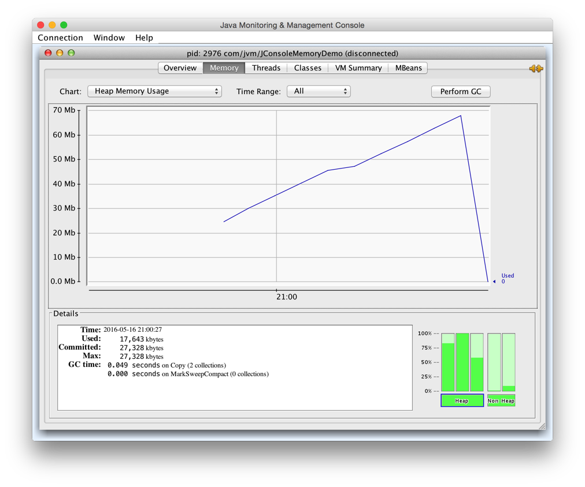
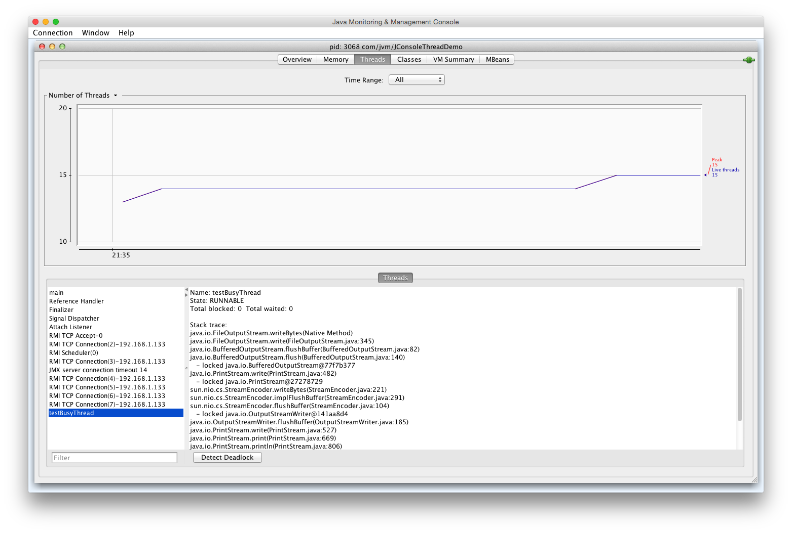
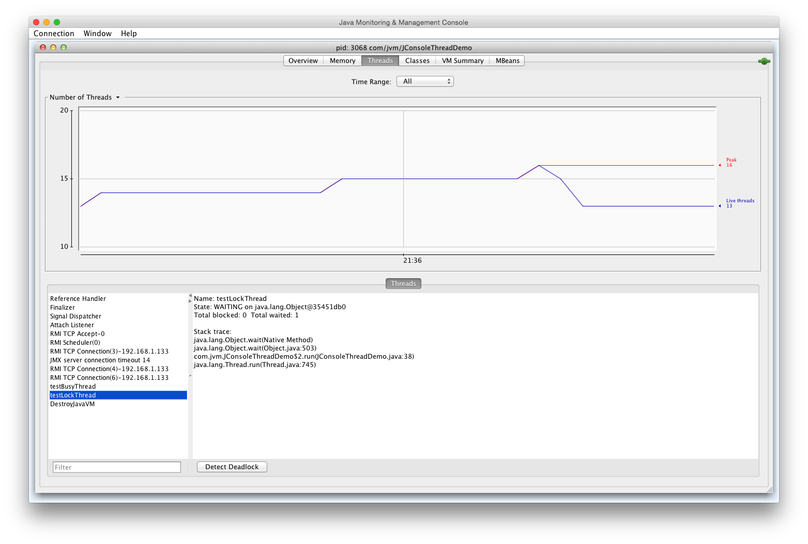
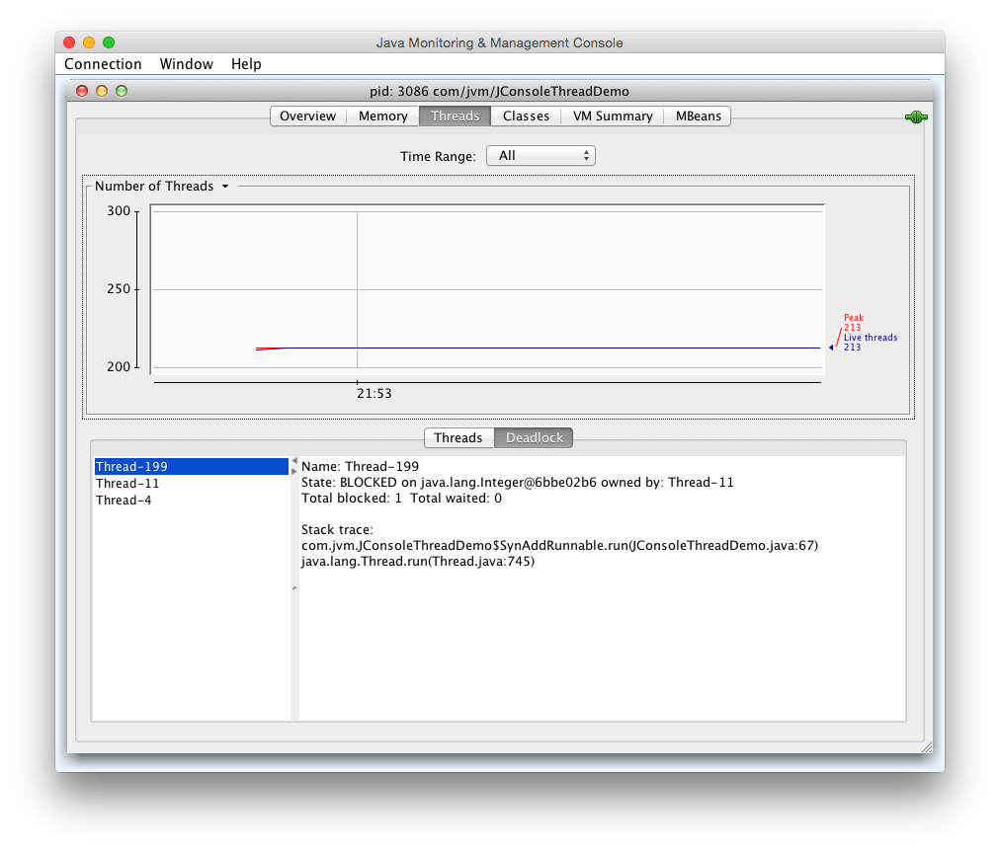

# JDK的可视化工具

JDK中除了提供大量的明命令行工具外，还提供了两个强大的可视化工具：JConsole 和 VisualVm。

其中 JConsole 是在 JDK1.5 时期就已经提供的虚拟机监控工具，而 VisualVM 在 JDK 1.6 Update7 中才首次发布。

## JConsole：Java监视与管理控制台

JConsole 是一种基于 JMX 的可视化监视、管理工具。

### 启动 JConsole

通过 JDK/bin 目录下的 jconsole.exe 启动 JConsole 后，将自动搜索出本机运行的所有虚拟机进程，不需要用户自己通过 jps 命令来查询。双击其中一个进程即可开始监控也可以使用下面的“远程进程”功能来连接远程服务器，对远程虚拟机进程监控。


JConsole 主界面一共有“概述”、“内存”、“线程”、“类”、“VM摘要”、“MBean”6个也签，如图所示：


“概述”页签显示的是整个虚拟机主要运行数据的概览，其中包括“堆内存使用情况”、“线程”、“类”、“CPU使用情况”4种信息的曲线图，这些曲线图后面是“内存”、“线程”、“类”页签的信息汇总，具体内容后面详细介绍。

### 内存监控

“内存”页签相当于可视化的 jstat 命令，用于监视受可视化参数管理的虚拟机内存（Java堆和永久代）的变化趋势。我们通过下面的代码来体验一下它的监视功能。运行时设置的虚拟机参数为：-Xms100m -Xmx100m -XX:+UseSerialGC，这块代码的作用是以 64KB/50毫秒 的速度往 Java 堆中填充数据，一共填充1000次，使用 JConsole 的“内存”页进行监视，观察曲线和柱状指示图的变化。

```bash
/**
 * 内存占位符对象，一个 OOMObject 大约占 64KB
 */
static class OOMObject{
    public byte[] placeholder = new byte[64 * 1024];
}
public static void fillHeap(int num) throws InterruptedException {
    List<OOMObject> list = new ArrayList<OOMObject>();
    for (int i = 0; i < num; i++) {
        //稍作延时，令监视曲线的变化更加明显
        Thread.sleep(50);
        list.add(new OOMObject());
    }
    System.gc();
}
public static void main(String args[])throws Exception {
    fillHeap(1000);
}
```

运行程序后可以发现整个堆是一条向上增长的平滑曲线。



当我们把监视区域缩小至Eden区时会发现其是一条折线图。从图中可以看出整个Eden区的大小是27328KB，默认情况下Eden:Survivor=8:1，所以整个新生代的大小是27328*125%=34160KB。当Eden区内存不足时，会执行GC，执行GC后Eden区被清空，所以Eden区才是折线图。


当我们把监视区域切换至老年代时，会发现其仍然是平稳上升并到达了一个顶点后稳定下去。


### 线程监控

“线程”页签的功能相当于可视化的jstack命令，遇到线程停顿时可以使用这个页签进行监控分析。之前说过导致线程长时间停顿的主要原因有：等待外部资源、死循环、锁等待等。下面我们通过代码来演示一下。

```java
/**
 * 线程死循环演示
 */
public static void createBusyThread() {
    new Thread(new Runnable() {
        @Override
        public void run() {
            int i = 1;
            while (true) {
                i++;
                System.out.println("Hello" + i);
            }
        }
    }, "testBusyThread").start();
}
/**
 * 测试锁等待演示
 * @param lock
 */
public static void createLockThread(final Object lock) {
    new Thread(new Runnable() {
        @Override
        public void run() {
            synchronized (lock) {
                try {
                    lock.wait();
                } catch (InterruptedException e) {
                    e.printStackTrace();
                }
            }
        }
    }, "testLockThread").start();
}
public static void main(String args[]) throws Exception {
    BufferedReader br = new BufferedReader(new InputStreamReader(System.in));
    br.readLine();
    createBusyThread();
    br.readLine();
    createLockThread(new Object());
}
```

运行程序后在“线程”页签中会发现只有main线程，其处于RUNNABLE状态，并且main线程在等待输入。当输入字符按下回车键之后，会多了一个testBusyThread的线程，并且显示其处于RUNNABLE状态，且一直在执行createBusyThread()方法22行处的代码 while(true)。这种死循环很耗CPU资源，在Windows系统下一不小心就会造成系统死机。



当我们再次往控制台输入字符并按下回车键时，会发现又多了一个testLockThread线程，显示testLockThread线程处于WAITING状态，并且处于代码第38行，即：lock.wait() 处。这种等待方式是正常的等待方式，只要有另外一个地方调用了 notify() 或 notifyAll() 方法，线程就有机会得以运行。



下面的代码演示了一个无法被激活的死锁等待。

```java
public static void main(String args[]) throws Exception {
    for (int i = 0; i < 100; i++) {
        new Thread(new SynAddRunnable(1, 2)).start();
        new Thread(new SynAddRunnable(2, 1)).start();
    }
}
static class SynAddRunnable implements Runnable {
    int a,b;
    public SynAddRunnable(int a, int b) {
        this.a = a;
        this.b = b;
    }
    public void run() {
        synchronized (Integer.valueOf(a)) {
            synchronized (Integer.valueOf(b)) {
                System.out.println(a + b);
            }
        }
    }
}
```

上面的代码因为Integer.valueOf()创建对象的原因，只存在一个new Integer(1)和一个new Integer(2)对象，因此会出现200个线程进行资源争夺的情况。这时候按下“Detect DeadLock”按钮可以检测是否有死锁存在，如果有死锁存在那么会新打开一个页签，如下图所示：



从上图可以看出Thread-199处于阻塞状态，原因是其中有一个锁被Thread-11持有，而Thread-11锁需要的锁又被Thread-4持有，Thread-4所需要的锁又被Thread-199持有，它们一起形成了一个死锁环。

## VisualVM：多合一故障处理工具


